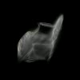
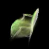
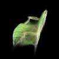

# Assignment 4: Simplified 3D Gaussian Splatting

## Environment

- OS / environment: Windows, conda environment `gdl_env`
- Python: 3.10.19, `D:\anaconda\envs\gdl_env\python.exe`
- PyTorch: 2.6.0+cu124
- GPU: NVIDIA GeForce RTX 4060 Ti 8GB, `8188 MiB` reported by `nvidia-smi`
- COLMAP: `D:\tools\COLMAP\bin\colmap.exe`, version 4.1.0.dev0 with CUDA
- Scene: `data/chair`
- Images: 100
- Valid COLMAP points: 13647, counted from `data/chair/sparse/0_text/points3D.txt`

The root README does not require a fixed training epoch count. `checkpoint_000060.pt` appears only in the optional video example, so the simplified renderer was trained with configurations that can complete reliably on the local 8GB GPU.

## Task 1: COLMAP SfM

Commands:

```bash
python mvs_with_colmap.py --data_dir data/chair
python debug_mvs_by_projecting_pts.py --data_dir data/chair
```

COLMAP 4.1 no longer accepts the old `--SiftExtraction.use_gpu` and `--SiftMatching.use_gpu` flags, so the script was updated to use `--FeatureExtraction.use_gpu` and `--FeatureMatching.use_gpu`.

Outputs:

- Sparse model: `data/chair/sparse/0_text/{cameras.txt,images.txt,points3D.txt}`
- Reprojection visualizations: `data/chair/projections/*.png`
- Logs: `data/chair/colmap_task1.log`, `data/chair/reprojection_debug.log`


## Task 2: Simplified 3DGS

Implemented and exposed the required simplified 3DGS pieces:

- `gaussian_model.py`: 3D covariance with `Cov = R S S^T R^T`; fallback for missing PyTorch3D KNN.
- `gaussian_renderer.py`: pinhole projection Jacobian, 2D covariance projection, Gaussian weights, and front-to-back alpha compositing.
- `data_utils.py`: configurable `downsample_factor`; optional point limit via `maximum_pts_num`; camera intrinsics `fx, fy, cx, cy` are divided by the downsample factor.
- `train.py`: CLI arguments `--max_points`, `--downsample_factor`, `--save_every`; final checkpoint saving; CUDA peak memory reporting.
- `render_3dgs_mv.py`: matching `--max_points` and `--downsample_factor` arguments.

The initial full-point short CUDA run with 13647 points and `downsample_factor=8` was not used as a final result. It ran very slowly and the loss became `nan` in `data/chair/checkpoints/train_simplified_short.log`. This is expected for the course simplified renderer because it constructs dense PyTorch tensors with shape close to `N x H x W`, unlike the official tile-based CUDA rasterizer.

### Controlled Training Runs

Final Task 2 main result: `max_points=5000`, `downsample_factor=8`, `num_epochs=30`, checkpoint `data/chair/checkpoints_ds8_5000_30/checkpoint_000030.pt`, video `data/chair/render_mv_30ep_5000_ds8.mp4`, final loss about `0.0400`, and peak CUDA memory about `4074.09 MiB` allocated / `4124.00 MiB` reserved.

| Run | Epochs | Points | Downsample | Video resolution | Final loss | Time | CUDA peak allocated / reserved | OOM | Main outputs |
|---|---:|---:|---:|---:|---:|---:|---:|---|---|
| Short stable run | 10 | 1000 | 16 | 50x50 | ~0.0584 | 45.41 s | 225.24 / 242.00 MiB | No | `data/chair/checkpoints/checkpoint_000010.pt`, `data/chair/render_mv_8gb.mp4` |
| Resume run | 30 total | 1000 | 16 | 50x50 | ~0.0557 | 85.72 s resume | 225.24 / 242.00 MiB | No | `data/chair/checkpoints_more/checkpoint_000030.pt`, `data/chair/render_mv_30ep_1000_ds16.mp4` |
| Higher resolution baseline | 30 | 1000 | 8 | 100x100 | ~0.0717 | 417.56 s | 828.04 / 890.00 MiB | No | `data/chair/checkpoints_ds8_1000_30/checkpoint_000030.pt`, `data/chair/render_mv_30ep_1000_ds8.mp4` |
| More points | 30 | 3000 | 8 | 100x100 | ~0.0459 | 1186.91 s | 2451.89 / 2492.00 MiB | No | `data/chair/checkpoints_ds8_3000_30/checkpoint_000030.pt`, `data/chair/render_mv_30ep_3000_ds8.mp4` |
| More points | 30 | 5000 | 8 | 100x100 | ~0.0400 | ~1934 s by log timestamps | 4074.09 / 4124.00 MiB | No | `data/chair/checkpoints_ds8_5000_30/checkpoint_000030.pt`, `data/chair/render_mv_30ep_5000_ds8.mp4` |

For the 5000-point run, `nvidia-smi` samples during training showed about 5.1 GB total GPU memory in use and 91-100% GPU utilization. Since this stayed below 6GB and no OOM occurred, I selected the `max_points=5000, downsample_factor=8` option rather than immediately switching to `downsample_factor=4`; this isolates the effect of more Gaussians at the same output resolution.

### Video Resolution Check

`ffprobe` confirmed that the ds8 videos are only `100x100`, and ds16 videos are `50x50`. Therefore part of the visible blur is directly caused by low render resolution.

```text
data/chair/render_mv_30ep_1000_ds16.mp4: 50x50
data/chair/render_mv_30ep_1000_ds8.mp4: 100x100
data/chair/render_mv_30ep_3000_ds8.mp4: 100x100
data/chair/render_mv_30ep_5000_ds8.mp4: 100x100
```

Comparison frames:





The 3000- and 5000-point videos recover more color and chair structure than the 1000-point ds8 run, and the loss is lower. However, the outputs remain visibly blurred because the output resolution is still 100x100 and the simplified renderer has limited Gaussian/color modeling.

### Scale and Opacity Diagnostics

Statistics were computed on the trained checkpoint parameters using `scale = exp(scales)` and `opacity = sigmoid(opacities)`. Full logs are in `data/chair/checkpoint_scale_opacity_stats.log`.

| Checkpoint | Scale median | Scale p95 | Scale max | Opacity median | Opacity p75 | Opacity mean | Interpretation |
|---|---:|---:|---:|---:|---:|---:|---|
| `1000_ds16_30ep` | 0.255315 | 1.065227 | 1.179368 | 0.007793 | 0.999999 | 0.492777 | Mixed transparent and saturated Gaussians |
| `1000_ds8_30ep` | 0.089244 | 1.065227 | 1.179368 | 1.000000 | 1.000000 | 0.736073 | Strong opacity saturation; fog-like blur likely |
| `3000_ds8_30ep` | 0.097957 | 0.513081 | 1.061099 | 0.999999 | 1.000000 | 0.725105 | Smaller high-percentile scale, but opacity still saturated |
| `5000_ds8_30ep` | 0.080414 | 0.399063 | 1.091130 | 0.999993 | 0.999999 | 0.713301 | More localized scales; alpha saturation remains |

Increasing point count reduces the high-percentile scale and improves loss, but opacity still saturates around 1.0 for many Gaussians. That behavior can create opaque layers and fog-like accumulation in the simplified alpha compositing pipeline.

## Task 3: Comparison with Official 3DGS

Official repository location: `../../gaussian-splatting`.

Official training command:

```bash
python train.py \
  -s D:\DIP-Teaching-main\Assignments\04_3DGS\data\chair \
  -m output\chair_dip_assignment \
  --iterations 1000 \
  -r 16 \
  --data_device cpu \
  --save_iterations 1000 \
  --test_iterations 1000 \
  --disable_viewer
```

This official 3DGS run is a 1000-iteration partial but runnable comparison, not a fully converged official benchmark. It initialized from all 13647 COLMAP points and completed 1000 iterations in 12.64 seconds after resolving a Windows write-permission issue for the generated PLY. Render command:

```bash
python render.py \
  -m output\chair_dip_assignment \
  -s D:\DIP-Teaching-main\Assignments\04_3DGS\data\chair
```

Official outputs:

- Log: `../../gaussian-splatting/output/chair_dip_assignment/train_official_3dgs_retry.log`
- Point cloud: `../../gaussian-splatting/output/chair_dip_assignment/point_cloud/iteration_1000/point_cloud.ply`
- Render images: `../../gaussian-splatting/output/chair_dip_assignment/train/ours_1000/renders/*.png`
- Example: `../../gaussian-splatting/output/chair_dip_assignment/train/ours_1000/renders/00000.png`


## Discussion

The simplified implementation is much less memory-efficient than official 3DGS because it uses dense PyTorch splatting over points and pixels. It does not have the official implementation's tile-based rasterizer, adaptive densification, visibility-aware rendering, pruning/culling, spherical harmonics color model, or mature scale/opacity controls.

On the RTX 4060 Ti 8GB GPU, the practical controls are `downsample_factor` and `max_points`. With `downsample_factor=16`, training is very fast but the video is only 50x50. With `downsample_factor=8`, videos are 100x100 and still blurred. Increasing from 1000 to 3000 and 5000 points improves loss and visible structure, but it does not remove blur because the renderer is still low-resolution and opacity tends to saturate.

The official CUDA implementation is not directly comparable by epoch count. It uses all initial points, optimized rasterization, and densification, so it trains far faster and with much better rendering machinery. The simplified version here is useful for understanding the math and pipeline, but it is not expected to match official 3DGS quality under the same 8GB hardware limit.

## Reproducibility

Key commands for the final simplified experiments:

```bash
python train.py \
  --colmap_dir data/chair \
  --checkpoint_dir data/chair/checkpoints_ds8_3000_30 \
  --num_epochs 30 \
  --debug_every 10 \
  --debug_samples 1 \
  --device cuda \
  --max_points 3000 \
  --downsample_factor 8

python render_3dgs_mv.py \
  --colmap_dir data/chair \
  --checkpoint data/chair/checkpoints_ds8_3000_30/checkpoint_000030.pt \
  --output data/chair/render_mv_30ep_3000_ds8.mp4 \
  --num_frames 120 \
  --fps 30 \
  --device cuda \
  --max_points 3000 \
  --downsample_factor 8

python train.py \
  --colmap_dir data/chair \
  --checkpoint_dir data/chair/checkpoints_ds8_5000_30 \
  --num_epochs 30 \
  --debug_every 10 \
  --debug_samples 1 \
  --device cuda \
  --max_points 5000 \
  --downsample_factor 8

python render_3dgs_mv.py \
  --colmap_dir data/chair \
  --checkpoint data/chair/checkpoints_ds8_5000_30/checkpoint_000030.pt \
  --output data/chair/render_mv_30ep_5000_ds8.mp4 \
  --num_frames 120 \
  --fps 30 \
  --device cuda \
  --max_points 5000 \
  --downsample_factor 8
```

## Checkpoints and Outputs

- `data/chair/sparse/0_text/points3D.txt`
- `data/chair/projections/r_0.png`
- `data/chair/checkpoints/train_simplified_8gb.log`
- `data/chair/checkpoints_more/train_resume_30ep.log`
- `data/chair/checkpoints_ds8_1000_30/train_30ep_1000_ds8.log`
- `data/chair/checkpoints_ds8_3000_30/train_30ep_3000_ds8.log`
- `data/chair/checkpoints_ds8_5000_30/train_30ep_5000_ds8.log`
- `data/chair/checkpoint_scale_opacity_stats.log`
- `data/chair/render_mv_30ep_1000_ds16.mp4`
- `data/chair/render_mv_30ep_1000_ds8.mp4`
- `data/chair/render_mv_30ep_3000_ds8.mp4`
- `data/chair/render_mv_30ep_5000_ds8.mp4`
- `../../gaussian-splatting/output/chair_dip_assignment/train_official_3dgs_retry.log`
- `../../gaussian-splatting/output/chair_dip_assignment/train/ours_1000/renders/00000.png`

## License / Acknowledgements

- Course code: DIP Assignment 4
- Official implementation: GraphDeco-INRIA 3D Gaussian Splatting
- Report structure reference: the submission template linked from the repository root README
