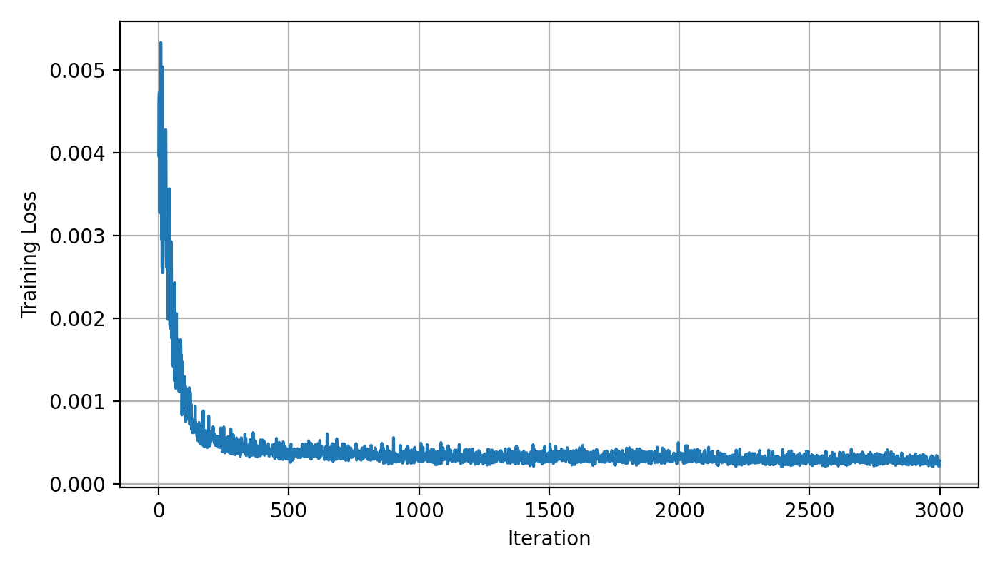
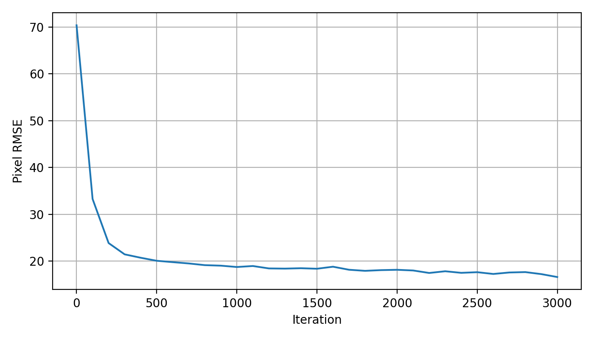
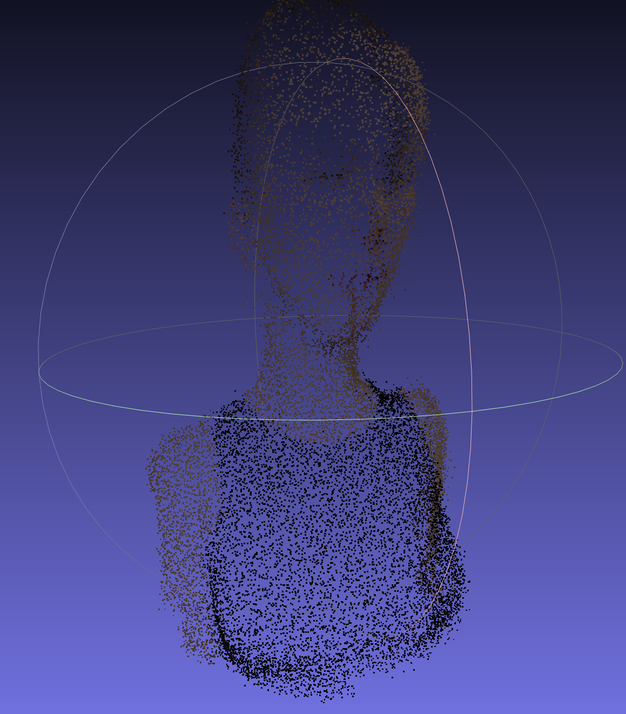
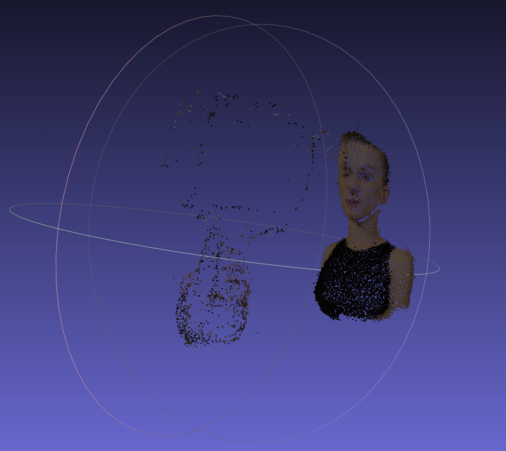

# Assignment 3
## Task 1：PyTorch Bundle Adjustment

## 1. 任务说明

本任务使用 PyTorch 从多视角 2D 观测中恢复三维点云、相机外参和共享焦距。输入数据为 `points2d.npz`，包含 50 个视角下 20000 个点的 2D 投影坐标及可见性标记。优化时只使用 `visibility = 1` 的观测点。

需要优化的参数包括：

| 参数 | 形状 | 说明 |
|---|---:|---|
| 3D 点坐标 | `(20000, 3)` | 待恢复的点云坐标 |
| 相机旋转 | `(50, 3)` | 使用 Euler 角表示 |
| 相机平移 | `(50, 3)` | 每个视角一组平移 |
| 焦距 | 标量 | 50 个相机共享 |

本实验在无 CUDA GPU 的环境下完成，训练过程使用 CPU mini-batch 优化。

---

## 2. 方法简介

对每个 3D 点，先通过相机外参变换到相机坐标系：

```text
Pc = R @ P + T
```

其中 `R` 由 Euler 角转换得到，`T` 为相机平移。随后按照作业给定的投影模型计算 2D 像素坐标：

```text
u = -f * Xc / Zc + cx
v =  f * Yc / Zc + cy
```

图像大小为 `1024 × 1024`，因此：

```text
cx = 512, cy = 512
```

优化目标是最小化预测 2D 点与观测 2D 点之间的重投影误差。只对可见点计算 loss：

```text
loss = mean(|| projected_2d - observed_2d ||^2)
```

为了提升数值稳定性，训练时将像素误差除以图像大小进行归一化，并加入了较小的深度约束，避免点跑到无效深度区域。

---

## 3. 初始化与训练设置

初始化方式如下：

| 参数 | 初始化方式 |
|---|---|
| 焦距 `f` | 初始化为 `900` |
| 相机平移 `T` | 初始化为 `[0, 0, -2.5]` |
| 相机旋转 | 使用 Euler 角，yaw 在一定范围内初始化 |
| 3D 点 | 根据平均 2D 观测反投影到原点附近 |

由于完整观测数量为：

```text
50 × 20000 = 1,000,000
```

直接全量优化在 CPU 上较慢，因此采用 mini-batch 训练。每次随机采样部分视角和部分 3D 点进行优化。

主要训练命令如下：

```bash
python ba_task1.py --data_dir data --out_dir outputs_task1 --iters 3000 --batch_views 10 --batch_points 4096 --init_f 900 --init_distance 2.5 --yaw_init_deg 40 --eval_every 100
```

优化器使用 Adam。

---

## 4. 实验结果

训练完成后，程序输出以下文件：

```text
outputs_task1/training_loss.png
outputs_task1/rmse_curve.png
outputs_task1/reconstruction.obj
outputs_task1/ba_result.pt
```

其中 `reconstruction.obj` 为最终恢复出的彩色 3D 点云，每一行格式为：

```text
v x y z r g b
```

颜色来自 `points3d_colors.npy`。

最终焦距和 RMSE 如下：

```text
Final focal length: [填写最终 f]
Final RMSE: [填写最终 RMSE] pixels
```

---

## 5. 可视化结果

### 5.1 Loss 曲线



### 5.2 RMSE 曲线



### 5.3 重建点云



---

## Task 2: COLMAP Sparse Reconstruction without CUDA GPU

由于本地环境没有 CUDA GPU，本实验只完成 COLMAP 的稀疏重建流程，未运行稠密重建步骤。

输入为 `data/images` 中的 50 张 1024×1024 渲染图像。由于这些图像来自同一个虚拟相机，并且没有明显镜头畸变，因此使用 `PINHOLE` 相机模型，并设置 `single_camera=1` 共享相机内参。为了在无 GPU 环境下运行，特征提取和特征匹配阶段均设置为 CPU 模式。

### Commands

使用的主要命令如下：

```bash
colmap feature_extractor \
    --database_path data/database.db \
    --image_path data/images \
    --ImageReader.single_camera 1 \
    --ImageReader.camera_model PINHOLE \
    --FeatureExtraction.use_gpu 0

colmap exhaustive_matcher \
    --database_path data/database.db \
    --FeatureMatching.use_gpu 0

colmap mapper \
    --database_path data/database.db \
    --image_path data/images \
    --output_path data/sparse

colmap model_converter \
    --input_path data/sparse/0 \
    --output_path data/sparse/sparse.ply \
    --output_type PLY

colmap model_converter \
    --input_path data/sparse/0 \
    --output_path data/sparse/sparse_txt \
    --output_type TXT
```

在 Windows 环境中，我实际使用 Anaconda Prompt 运行了等价的单行命令。由于系统没有 CUDA GPU，因此 feature extraction 和 feature matching 都使用 CPU 模式运行。

### Output Files

COLMAP 稀疏重建完成后，主要输出文件如下：

```text
data/
├── database.db
└── sparse/
    ├── 0/
    │   ├── cameras.bin
    │   ├── images.bin
    │   └── points3D.bin
    ├── sparse.ply
    └── sparse_txt/
        ├── cameras.txt
        ├── images.txt
        └── points3D.txt
```

其中，`data/sparse/0` 是 COLMAP 输出的二进制稀疏模型；`sparse.ply` 用于在 MeshLab / CloudCompare 中可视化；`sparse_txt` 是将二进制模型转换为文本格式后的结果，便于统计注册图像数量和稀疏点数量。

### Results

COLMAP 成功完成了 CPU feature extraction、exhaustive feature matching 和 sparse reconstruction。Feature extraction 阶段成功处理了 50 张输入图像；feature matching 阶段完成了 exhaustive matching 和 geometric verification；mapper 阶段成功找到初始图像对，并逐步注册图像、执行 triangulation 和 bundle adjustment。

最终结果如下：

| Item | Result |
|---|---:|
| Input images | 50 |
| Registered images | 50 / 50 |
| Sparse 3D points | 1636 |
| Camera model | PINHOLE |
| GPU used | No |

从日志可以看到，COLMAP 最终保留了一个 successful reconstruction，说明稀疏重建流程成功完成。

### Visualization

下图展示了使用 MeshLab 打开的 COLMAP 稀疏点云结果：



### Discussion

由于本实验使用的是渲染图像，图像之间的视角变化较规则，且所有图像来自同一个虚拟相机，因此使用 `single_camera=1` 和 `PINHOLE` 相机模型是合理的。COLMAP 能够从图像中自动提取 SIFT 特征、完成两两匹配，并通过 incremental SfM 估计相机位姿和稀疏 3D 点云。