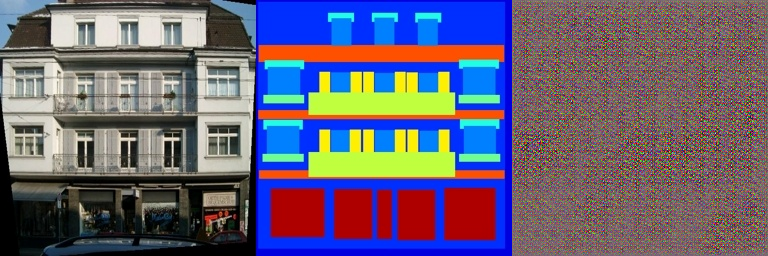
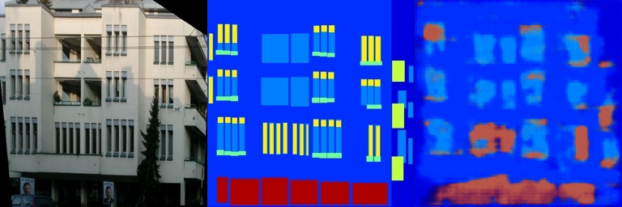
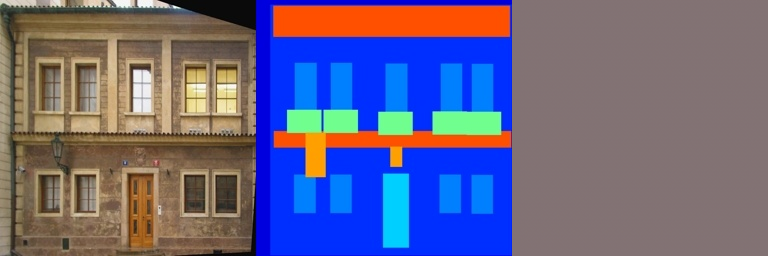
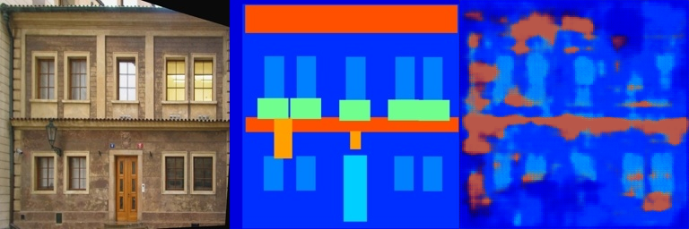

# 作业 2 - 使用 PyTorch 的数字图像处理

## 环境要求

推荐的环境配置：

```bash
conda create -n dip_hw2 python=3.13 -y
conda activate dip_hw2
pip install torch gradio opencv-python pillow numpy
```

对于 Pix2Pix 数据集脚本，需要系统中可用 bash、wget 和 tar。

## 训练

### 任务 1：泊松图像编辑

运行 Gradio 演示程序：

```bash
python run_blending_gradio.py
```

然后：
1. 上传前景图像。
2. 点击点选绘制一个多边形。
3. 点击 `Close Polygon`。
4. 上传背景图像。
5. 调整 `dx` 和 `dy`。
6. 点击 `Blend Images`。

### 任务 2：Pix2Pix

在 `Pix2Pix/` 文件夹内运行以下命令：

```bash
bash download_facades_dataset.sh
python train.py
```

训练使用 Facades 数据集。脚本会每 50 个 epoch 保存一次检查点，并且每 5 个 epoch 将可视化对比图保存到 `train_results/` 和 `val_results/` 中。

## 评估

### 任务 1

通过 Gradio 演示程序进行可视化评估。结果应当是在所选多边形区域内实现自然无缝的融合。

### 任务 2

在 `Pix2Pix/` 文件夹中运行 `python train.py` 以训练 FCN 生成器，使用的数据集为 Facades。
脚本会在本地保存检查点和可视化对比图。

## 结果

### 任务 1：泊松图像编辑

下面的示例使用的是 Monalisa 图像对以及提供的融合结果。

| Source | Target | Result |
|---|---|---|
|  |  |  |

### 任务 2：Pix2Pix

下面的样例展示了 `epoch_0` 和 `epoch_300` 时的训练集与验证集对比结果。

#### 训练结果

| Epoch 0 | Epoch 300 |
|---|---|
|  |  |

#### 测试结果

| Epoch 0 | Epoch 300 |
|---|---|
|  |  |